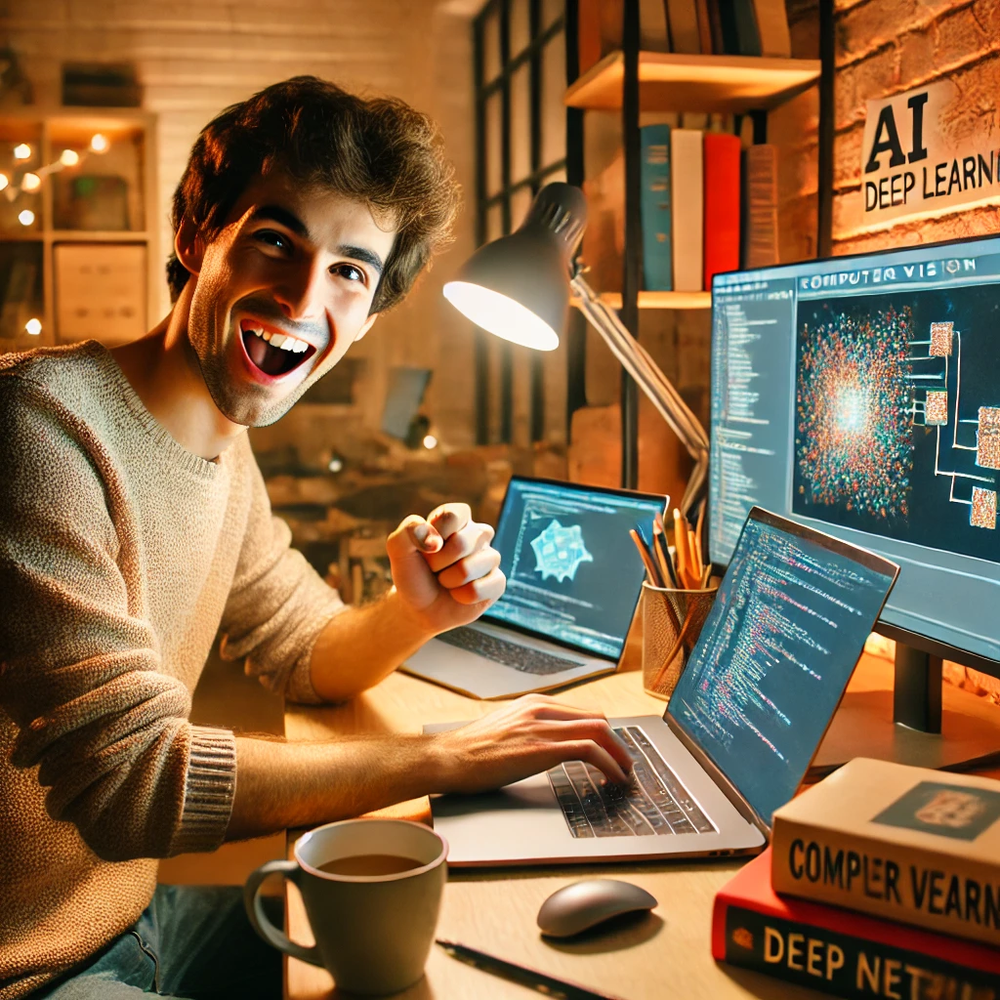

<p align="center">
    
</p>

## Restoration OCR - finetuning DiffBIR


### Code preparation

```shell
# clone repo
git clone https://github.com/jinlovespho/DiffBIR.git
cd DiffBIR 

# create environment
conda create -n pho_diffbir python=3.10 -y
conda activate pho_diffbir

# install torch first
pip install torch==2.2.2 torchvision==0.17.2 torchaudio==2.2.2 --index-url https://download.pytorch.org/whl/cu121
# then install other libraries
pip install -r requirements.txt
# install detectron2
python -m pip3 install 'git+https://github.com/facebookresearch/detectron2.git'
cd detectron2 
pip3 install -e .
```


### Run training script 
```shell
cd DiffBIR
bash run_script/train_script/run_train_diffbir_sam_try1.sh
```
