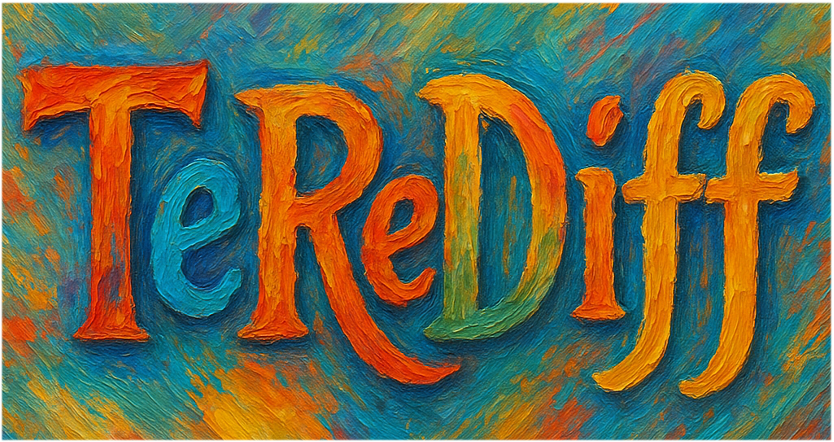

<table align="center">
  <tr>
    <td>
      
    </td>
    <td>
      <h1 style="margin: 0;">Text-Aware Image Restoration with Diffusion Models</h1>
      <p>
        <a href="https://arxiv.org/abs/2506.09993"></a>
        <a href="https://cvlab-kaist.github.io/TAIR/"></a>
        <a href="https://huggingface.co/datasets/Min-Jaewon/SA-Text"></a>
        <a href="https://huggingface.co/datasets/Min-Jaewon/Real-Text"></a>
      </p>
    </td>
  </tr>
</table>

<div align="left">

[Jaewon&nbsp;Min<sup>1*</sup>](https://github.com/Min-Jaewon/) · 
[Jin&nbsp;Hyeon&nbsp;Kim<sup>2*</sup>](https://github.com/jinlovespho) · 
Paul&nbsp;Hyunbin&nbsp;Cho<sup>1</sup> · 
[Jaeeun&nbsp;Lee<sup>3</sup>](https://github.com/babywhale03) · 
Jihye&nbsp;Park<sup>4</sup> · 
Minkyu&nbsp;Park<sup>4</sup> · 
Sangpil&nbsp;Kim<sup>2†</sup> · 
Hyunhee&nbsp;Park<sup>4†</sup> · 
[Seungryong&nbsp;Kim<sup>1†</sup>](https://cvlab.kaist.ac.kr/)

<sup>*</sup> Equal contribution
<sup>1</sup> KAIST&nbsp;AI ·
<sup>2</sup> Korea&nbsp;University ·
<sup>3</sup> Yonsei&nbsp;University ·
<sup>4</sup> Samsung&nbsp;Electronics


</div>

## 📢 News
- 🤗 **2025.06.19** — **SA-Text** and **Real-Text** datasets are released along with the [dataset pipeline](https://github.com/paulcho98/text_restoration_dataset/tree/main)!
- 📄 **2025.06.12** — Arxiv paper is released! 
- 🚀 **2025.06.01** — Official launch of the repository and project page!


## 💾 SA-Text Dataset
**SA-Text** is a newly proposed dataset for **Text-Aware Image Restoration (TAIR)** task. It is built from  **SA-1B** dataset using our [dataset pipeline](https://github.com/paulcho98/text_restoration_dataset/tree/main) and  consists of **100K** image-text instance pairs with detailed scene-level annotations.

**Real-Text** is an evaluation dataset for real-world scenarios. It is constructed from [RealSR](https://github.com/csjcai/RealSR) and [DrealSR](https://github.com/xiezw5/Component-Divide-and-Conquer-for-Real-World-Image-Super-Resolution) using same pipeline as above.

---

### Dataset Download

| Split             | Hugging Face 🤗 | Google Drive 📁 |
|------------------|:---------------:|:---------------:|
| **SA-Text**       | <div align="center">[Link](https://huggingface.co/datasets/Min-Jaewon/SA-Text)</div> | <div align="center">[Link](https://drive.google.com/file/d/1wnGBwrRNJ-hegPtvt8s4y-iXgdED16L4/view?usp=sharing)</div> |
| **Real-Text**     | <div align="center">[Link](https://huggingface.co/datasets/Min-Jaewon/Real-Text)</div> | <div align="center">[Link](https://drive.google.com/file/d/1sIjeFe0Rq6IvYEC-pkz6aQ4ubuIge4xi/view?usp=sharing)</div> |


### Structure of dataset from 'Google Drive'
```
SA-Text/
├── images/                        # 100K hiqh-quality scene images with text instances
└── restoration_dataset.json       # Annotations

Real-Text/
├── HQ/                            # High-quality images
├── LQ/                            # Low-quality degraded inputs
└── real_benchmark_dataset.json    # Annotations
```
---

### Notes

- Each image is paired with one or more text instances with polygon-level annotations.
- The dataset follows a consistent annotation format, detailed in the [dataset pipeline](https://github.com/paulcho98/text_restoration_dataset/tree/main).
- We recommend using the dataset from Google Drive for testing our code.


## ⚒️ Dependency and Environment Setup

#### 1. Clone repo
```
git clone https://github.com/jinlovespho/DiffBIR.git -b pho
cd DiffBIR 
```

#### 2. Setup conda environment
```
conda create -n terediff python=3.10 -y
conda activate terediff
```

#### 3. Install libraries
```
# torch installation
pip install torch==2.2.2 torchvision==0.17.2 torchaudio==2.2.2 --index-url https://download.pytorch.org/whl/cu121

# other requirements
pip install -r requirements.txt

# install detectron2 if detectron2 is not in the folder
# python -m pip3 install 'git+https://github.com/facebookresearch/detectron2.git'
cd detectron2 
pip install -e .

# install testr
cd testr 
pip install -e .
```

#### 4. Download pretrained weights
1. First download pretrained weights by running the following bash file.
```
bash download_weights.sh
```
2. Additionally, download the pretrained text spotting module's weight from this [link](https://ucsdcloud-my.sharepoint.com/personal/xiz102_ucsd_edu/_layouts/15/onedrive.aspx?id=%2Fpersonal%2Fxiz102%5Fucsd%5Fedu%2FDocuments%2Fpublish%2Fcvpr22%5Ftestr%2Fweights%2Ftotaltext%5Ftestr%5FR%5F50%5Fpolygon%2Epth&parent=%2Fpersonal%2Fxiz102%5Fucsd%5Fedu%2FDocuments%2Fpublish%2Fcvpr22%5Ftestr%2Fweights&ga=1) and place it inside **./weights** folder.


#### 5. Download dataset


## 🔧 Training 
Our text-aware restoration model, **TeReDiff**, comprises two main modules: an image restoration module and a text spotting module. 
Training is conducted in three stages:
- **Stage 1**: Train only the image restoration module.
- **Stage 2**: Train only the text spotting module.
- **Stage 3**: Jointly train both modules.
---

### Stage1 Training Script
Run the following bash script for **Stage1** training. Its configuration file can be found [here](configs/train/train_stage1_terediff.yaml)

```
bash run_script/train_script/run_train_stage1_terediff.sh
```

### Stage2 Training Script
Run the following bash script for **Stage2** training. Its configuration file can be found [here](configs/train/train_stage2_terediff.yaml)

```
bash run_script/train_script/run_train_stage2_terediff.sh
```

### Stage3 Training Script
Run the following bash script for **Stage3** training. Its configuration file can be found [here](configs/train/train_stage3_terediff.yaml)

```
bash run_script/train_script/run_train_stage3_terediff.sh
```


## 🚀 Inference 
The following scripts can be used for inferencing on low-quality images to obtain high-quality text-aware restored images.

### Evaluation on SA-Text (Lv1) 
```

```

### Evaluation on SA-Text (Lv2)
```

```

### Evaluation on SA-Text (Lv3)
```

```

### Evaluation on Real-Text
```

```


## Citation

If you find our work useful for your research, please consider citing it :)

```
@article{min2025text,
  title={Text-Aware Image Restoration with Diffusion Models},
  author={Min, Jaewon and Kim, Jin Hyeon and Cho, Paul Hyunbin and Lee, Jaeeun and Park, Jihye and Park, Minkyu and Kim, Sangpil and Park, Hyunhee and Kim, Seungryong},
  journal={arXiv preprint arXiv:2506.09993},
  year={2025}
}
```
