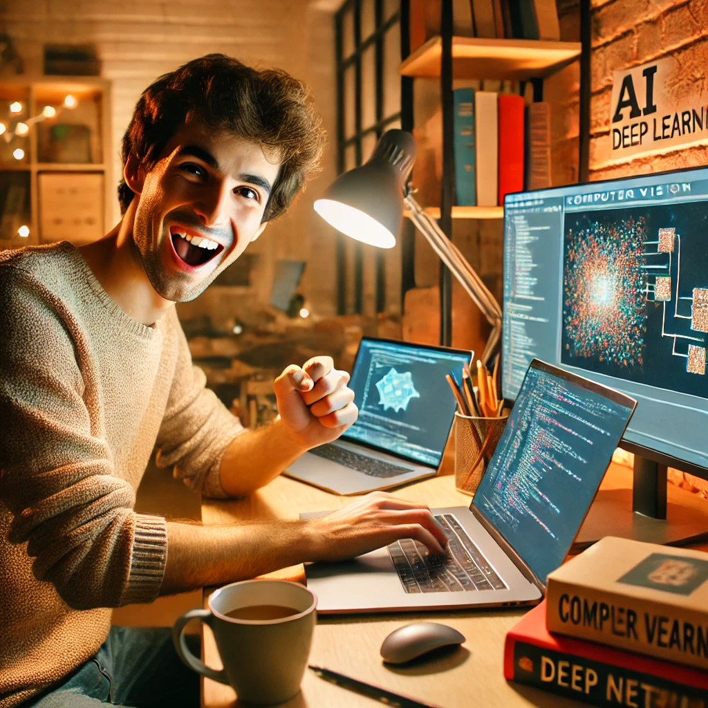

<p align="center">
    
</p>

## Restoration OCR - finetuning DiffBIR


### Code preparation

```shell
# clone repo
git clone https://github.com/jinlovespho/DiffBIR.git -b jihye
cd DiffBIR 

# create environment
conda create -n pho_diffbir python=3.10 -y
conda activate pho_diffbir

# install torch first
pip3 install torch==2.2.2 torchvision==0.17.2 torchaudio==2.2.2 --index-url https://download.pytorch.org/whl/cu121
# then install other libraries
pip3 install -r requirements.txt
# install detectron2 if detectron2 is not in the folder
# python -m pip3 install 'git+https://github.com/facebookresearch/detectron2.git'
cd detectron2 
pip3 install -e .
# install testr
cd testr 
pip3 install -e .
```


### Download pretrained weights 
```shell
bash download_weights.sh
```


### Experiment config file location
```shell
configs/train
```


### Stage1 training script 
```shell
cd DiffBIR

# run diffbir baseline
# config location: configs/train/train_diffbir_sam_cleaned_100k_diffbirBaseline_stage1_swinCode_kernelCode_ctrlV2_unetV2.yaml
bash run_script/train_script/run_train_diffbir_sam_cleaned_100k_diffbirBaseline_stage1_swinCode_kernelCode_ctrlV2_unetV2.sh

# run diffbir ours1
# config location: configs/train/train_diffbir_sam_cleaned_100k_ours_stage1_swinCode_kernelCode_ctrlV2_unetV2.yaml
bash run_script/train_script/run_train_diffbir_sam_cleaned_100k_ours_stage1_swinCode_kernelCode_ctrlV2_unetV2.sh

# run diffbir ours2
# config location: configs/train/train_diffbir_sam_cleaned_100k_ours_stage1_swinReal_kernelReal_ctrlV2_unetV2.yaml
bash run_script/train_script/run_train_diffbir_sam_cleaned_100k_ours_stage1_swinReal_kernelReal_ctrlV2_unetV2.sh

# run diffbir ours3
# config location: configs/train/train_diffbir_sam_cleaned_100k_ours_stage1_swinReal_kernelReal_ctrlV21_unetV21.yaml
bash run_script/train_script/run_train_diffbir_sam_cleaned_100k_ours_stage1_swinReal_kernelReal_ctrlV21_unetV21.sh

# run diffbir ours4
# config location: configs/train/train_diffbir_sam_cleaned_100k_ours_stage1_swinCode_kernelOurs_ctrlV2_unetV2.yaml
bash run_script/train_script/run_train_diffbir_sam_cleaned_100k_ours_stage1_swinCode_kernelOurs_ctrlV2_unetV2.sh  


```

### Stage2 training script 
```shell

# stage2 - run diffbir ours1 
# config location: configs/train/train_diffbir_sam_cleaned_100k_ours_stage2_swinCode_kernelCode_ctrlV2_unetV2.yaml
bash run_script/train_script/run_train_diffbir_sam_cleaned_100k_ours_stage2_swinCode_kernelCode_ctrlV2_unetV2.sh

# stage2 - run diffbir ours2
# config location: configs/train/train_diffbir_sam_cleaned_100k_ours_stage2_swinReal_kernelReal_ctrlV2_unetV2.yaml
bash run_script/train_script/run_train_diffbir_sam_cleaned_100k_ours_stage2_swinReal_kernelReal_ctrlV2_unetV2.sh

# stage2 - run diffbir ours3
# config location: configs/train/train_diffbir_sam_cleaned_100k_ours_stage2_swinReal_kernelReal_ctrlV21_unetV21.yaml
bash run_script/train_script/run_train_diffbir_sam_cleaned_100k_ours_stage2_swinReal_kernelReal_ctrlV21_unetV21.sh
```